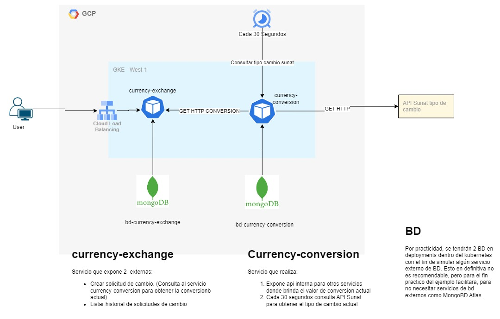
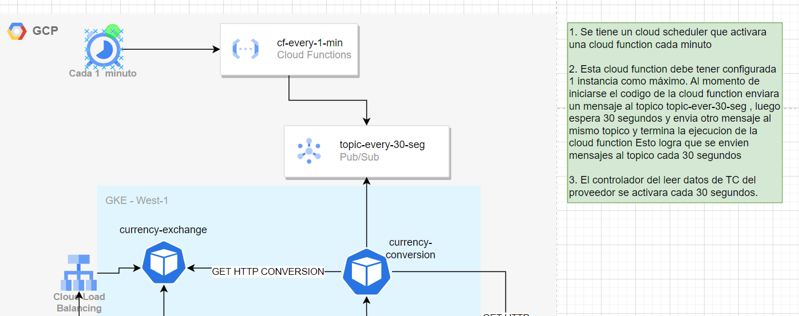
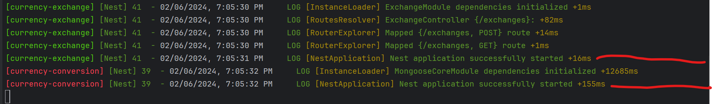
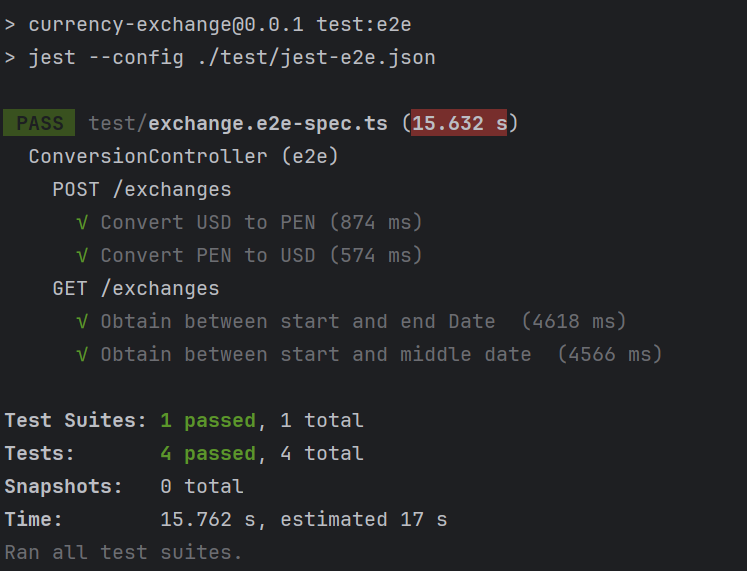
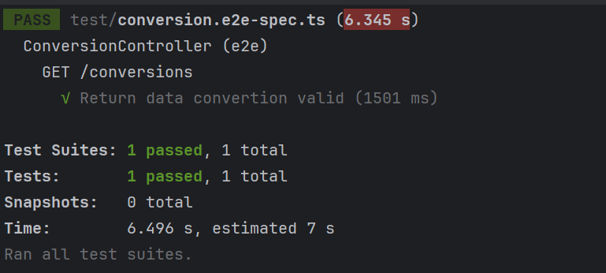

Solucion del problema

Resuelto Por: Gustavo Condezo



Se considero:
- Observabilidad con:
  - trace : trazabilidad a traves de los servicios 
  - logs
  - BD Separadas por servicio

Puntos adicionales por considerar:
- Health-Check
- Librerias de clases propias compartidas
- 
## Ejecucion de obtencion del TC del proveedor cada 30 Segundos
El cron en general solo se puede ejecutar cada minuto como minimo, asi que se consideraron dos posibles artificios para lograr ejecutar cada 30 segundos.
1. Cron de Kubernetes (Se aplico esta solucion por practicidad)
   Se configura un cron cada minuto y este llama a la api POST /conversions del servicio currency-conversion , lo que activa un metodo para leer y guardar TC de la SUNAT
2. Cron de Cloud Scheduller con cloud function  topicos (Se recomiendaria)



## Como ejecutar el proyecto en local:

Previamente debe tener instalado:
- Docker
- Skaffold

1. Instalar Docker desktop , ademas de activado y configurado adecuadamente kubernetes
2. Instalar skaffold. Se tiene 2 opciones varias formas de instalar skaffold, escoja la que se acomode a su entorno:

    a) Si se tiene instalado previamente el sdk de gcloud ( instalar sdk con: https://cloud.google.com/sdk/docs/downloads-versioned-archives?hl=es-419).
         Luego ejecutar estos comandos en consola:

    ```shell
      gcloud components update
    ```
             
      Esto actualizara las dependencias del sdk gcloud de ser necesario.
            
      Luego, en consola, ejecute:
            
    ````shell
    gcloud components install skaffold

    ````
    Con esto se instalara skaffold y podremos usarlo desde consola.
        
    b) Instalar directamente el cli de skaffold, en el siguiente link esta la guia para instalarlo.
            
      ````

       https://skaffold.dev/docs/install/#standalone-binary

      ````
    Validar que el kubernetes context este en docker-desktop
   3. Una vez instalado el cli de skaffold adecuadamente. Ejecute el siguiente comando en el root del proyecto (nivel del archivo skaffold.yaml).
       ````shell
       skaffold dev
       ````
       Tomara unos minutos y le saldran logs indicando que se esta construyendo las imagenes y posteriorment iniciara los servicios en GKE.
       El mensaje que indica que inicio satisfactoriamente los servicios
        

## Probar el proyecto en local
Se tiene 2 servicios

### Servicio exchanges (Externo) (currency-exchange folder)
Unicamente el servicio exchange expone dos APIs accesibles desde fuera del cluster.
Puede acceder en la siguiente abriendolo en un navegador web

````
http://localhost:4000/api-docs
````
Le abrira una pagina de swagger con las apis del servicio exchange documentado, pudiendo interactuar y llamar a las apis.
    - Crear exchange
    - Listar exchanges
Adicional Se comparte un postman collection con las apis de ejemplo

### Servicio conversion (interno) (currency-conversion folder)
Como el servicio es interno , no se puede acceder llamando desde fuera de kubernetes.

Se puede ver su api interna que expone ejecutando el micro fuera de kubernetes (de forma aislada)

## Prueba End to End
### Servicio exchanges tiene Pruebas e2e.
Para ejecutarlo:
1. Posicionarse en la carpeta currency-exchange y ejecutar
````shell
npm install
````
Esto instalara todas las dependencias necesarias
2. Luego de haber instalado las dependencias necesarias ejecutar el siguiente codigo:
````shell
npm run test:e2e
````
Debe dar como resultado:


### Servicio conversion tiene Pruebas e2e.
Para ejecutarlo:
1. Posicionarse en la carpeta conversion-exchange y ejecutar
````shell
npm install
````
Esto instalara todas las dependencias necesarias
2. Luego de haber instalado las dependencias necesarias ejecutar el siguiente codigo:
````shell
npm run test:e2e
````
Debe dar como resultado:

