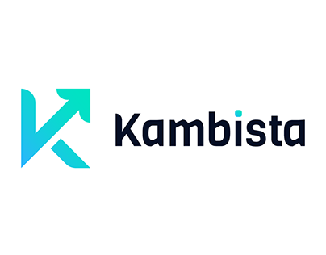
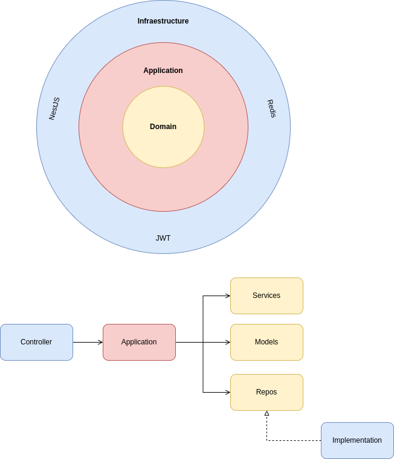
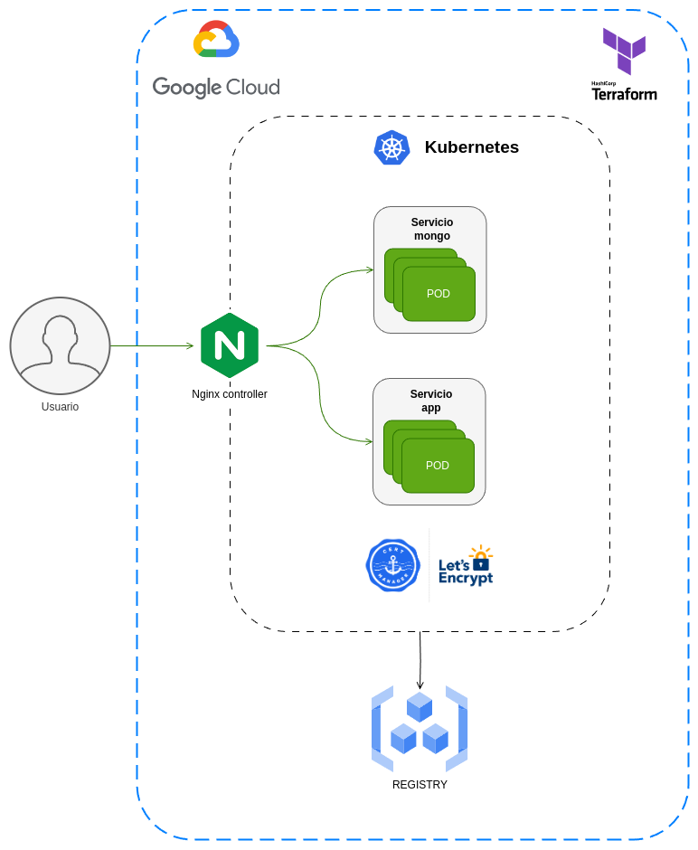
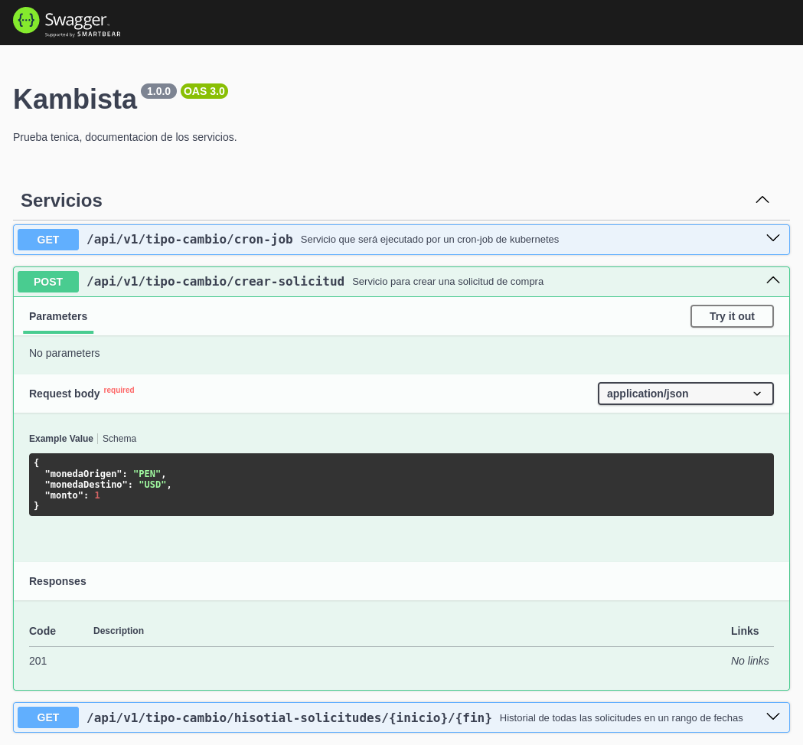
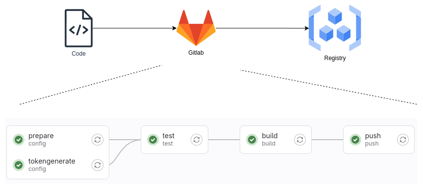

<h1 align="center">
  <br>
  
  <br>
  PRUEBA TECNICA
  <br>
</h1>

## Tabla de contenido [](#table-of-contents)

- [Arquitectura del proyecto](#ref1)
- [Arquitectura de la infraestructura](#ref2)
- [Documentación de la API](#ref3) 
- [Levantar en local](#ref4) 
- [Levantar en la nube](#ref5) 
- [Extra - CI/CD](#ref6) 


## 1. Arquitectura del proyecto[](#ref1)

La estructura del proyecto fue creada usando <b>Arquitectura Hexagonal</b> siguiendo un enfoque en el dominio con <b>DDD(Domain-Driven-Design)</b>.

Representacion gráfica:

<div align="center" style="padding:10px; background:white;border-radius:5px"></div>


## 2. Arquitectura de la infraestructura[](#ref5)

El despliegue en la nube de Google sigue la siguiente estructura: 

<div align="center" style="padding:10px; background:white;border-radius:5px"></div>

<br> 


## 4. Documentacion de la API[](#ref4)

Cada servicio creado esta documentado usando Swagger que tiene una amigable integracion con NestJS:

<div align="center" style="padding:10px; background:white;border-radius:5px"></div>

## 3. Levantar en local[](#ref1)

Se debe tener instalado Docker y Minikube en la pc en donde se de sea probar la aplicacion.

- Iniciar minikube
  ```bash
  minikube start
  minikube dashboard
  ```
- Cambiar el contexto de docker para que apunto al registry de minikube
  ```bash
  eval $(minikube docker-env)
  ```
- Compilar el proyecto
  ```bash
  cd ./backend && npm run build
  ```
- Posicionarse en la raiz del proyecto y contruir la imagen
  ```bash
  docker build -t kambistatest:v1.0.0  -f deploy/Local/Docker/Dockerfile .
  ```
- Ejecutar cada archivo yml de la ruta ./deploy/Local/K8s/*
  ```bash
  cd deploy/Local/K8s/
  kubectl apply -f ./1kambista-namespace.yml
  kubectl apply -f ./2mongo-deployment.yml
  kubectl apply -f ./3mongo-service.yml

  kubectl apply -f ./4kambista-deployment.yml
  kubectl apply -f ./5kambista-service.yml
  kubectl apply -f ./6kambista-ingress.yml

  kubectl apply -f ./7kambista-cronjob.yml
  ```

- Ver la direccion la Ip del ingress
  ```bash
  kubectl get ingress --namespace mi-namespace
  ```
  
- Ver los servicios levantados en swagger - ingresar a la url
  ```bash
  http://${IP_INGRESS}/api/docs
  ```

- Ver la data en mongo, ingresar al pod
  ```bash
  mongosh -u root -p example
  use admin
  db.tipo_cambio.find().size()
  ```

- Eliminar todos los recursos creados
  ```bash
  kubectl delete all --all -n mi-namespace
  kubectl delete namespaces mi-namespace
  ```

## 3. Levantar en la nube[](#ref1)

Se debe tener instalado el SDK de google, Kubectl y Terraform.

- Contruir la imagen en local o en un runner
  ```bash
  cd ./backend && npm run build
  docker build -t kambistatest:v1.0.0  -f deploy/Gcp/Docker/Dockerfile .
  ```

- Subir la imagen al registry de google
  ```bash
  docker login -u _json_key -p "$(cat ./deploy/Gcp/Terraform/credenciales_gcp.json)" https://us.gcr.io
  docker tag kambistatest:v1.0.0  us.gcr.io/ace-rider-182920/kambistatest:v1.0.0
  docker push us.gcr.io/ace-rider-182920/kambistatest:v1.0.0 
  ```

- Crear la infraestructura con terraform en la nube
  ```bash
  cd ./deploy/Gcp/Terraform
  terraform init
  terraform apply
  ```

- Conectarse al cluster K8s
  ```bash
  gcloud container clusters get-credentials my-cluster --zone us-east4-c --project ace-rider-182920
  ```

- Instalar el nginx controller
  ```bash
  helm repo add ingress-nginx https://kubernetes.github.io/ingress-nginx
  helm repo update
  helm install nginx-ingress ingress-nginx/ingress-nginx
  kubectl get service nginx-ingress-ingress-nginx-controller
  ```

- Instalar el cert manager
  ```bash
  helm repo add jetstack https://charts.jetstack.io
  helm repo update
  helm install cert-manager jetstack/cert-manager --namespace cert-manager --create-namespace --version v1.10.0 --set installCRDs=true
  kubectl -n cert-manager get pod
  ```

- Crear los certificados
  ```bash
  cd ./deploy/Gcp/K8s
  kubectl apply -f ./1kambista-namespace.yml

  kubectl apply -f ./clusterissuer.yml
  kubectl get clusterissuer
  kubectl describe  clusterissuer mi-cluster-issuer

  kubectl apply -f ./certificate.yml 
  kubectl get certificate --all-namespaces
  kubectl describe certificate kambista-cert -n mi-namespace
  kubectl get secrets --all-namespaces
  ```

- Ejecutar cada archivo yml
  ```bash
  kubectl apply -f ./2mongo-deployment.yml
  kubectl apply -f ./3mongo-service.yml
  kubectl apply -f ./4kambista-deployment.yml
  kubectl apply -f ./5kambista-service.yml
  kubectl apply -f ./6kambista-ingress.yml
  ```

- Ver los servicios en swagger

 
## 4. Extra - CI/CD[](#ref4)

Para automatizar todo el proceso desde la creacion del proyecto hasta el despliegue:

<div align="center" style="padding:10px; background:white;border-radius:5px"></div>

Gracias...